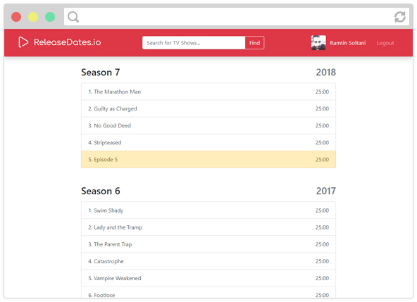

# ReleaseDates.io

ReleaseDates.io is a Single Page Application created with Angular 5 + Typescript, Firebase, and Node JS (backend) which uses TheTVDB and DailyMotion APIs for the data solution to allow users to:

  - Search for TV Shows
  - Discover TV Shows
  - View detailed information of TV Shows (including plot, seasons, episodes, airtime, release dates, etc.)
  - Find streams on DailyMotion
  - And pin their favorite TV Shows to track for new episodes

This web app is currently live at <http://releasedates.s3-website-us-west-1.amazonaws.com>.

# Screenshots

<br><br>
<br><br>
<br><br>
<br><br>
<br><br>


# Building Locally

**Before building the web app, make sure you read the [License Agreement](./LICENSE) and the following to make sure we are on the same page:**
  - You may use the live version of the web app or build one locally in anyway you see fit.
  - You may modify the code, either for contribution or personal use.
  - You may not host the web app online or distribute the web app, either for commercial or personal use.
---
To build this SPA locally, make sure you have checked all the prerequisites and follow the instructions below.

## Prerequisites

  - Download and install Node JS: <https://nodejs.org/>
  - Make sure both Node JS and NPM are installed by running `node --version` and `npm --version`
  - You need to have a Firebase account and a dedicated project (it's free!)
  - Configure your Firebase project by following [these instructions](docs/firebase-setup.md)

## Build Instructions

  1. Clone the [backend repo](https://github.com/ramtinsoltani/releasedates-backend-public) on your machine
  2. Configure the backend server by following [these instructions](docs/backend-setup.md)
  3. Clone this repo on your machine
  4. Run `npm install` to install all the dependencies
  5. Create a new file called `credentials.json` in the `src` directory and fill it with your Firebase web credentials and the address of the backend like below:
  ```json
  {
    "firebase": {
      "apiKey": "...",
      "authDomain": "...",
      "databaseURL": "...",
      "projectId": "...",
      "storageBucket": "...",
      "messagingSenderId": "..."
    },
    "backend": {
      "url": "http://localhost:3000"
    }
  }
  ```
  6. Start the backend server by running `node index.js`
  7. Run `ng serve` to build the SPA

If you have followed the instructions correctly, you should have the SPA running on `localhost:4200`.

# Usage

## Front Page

Includes two sections: Pins and Discover. The discover sections displays random TV Shows and the Pins sections displayed all of the TV Shows you have pinned for easy access (this feature requires you to be logged in).

## Search

In the header's textbox, you can search for TV Shows by name and get the results.

## Series View

Displays information about the TV Show, and a list of episodes categorized by season number. Clicking on an episode would display a window with the season info and the available streams on DailyMotion. You can also pin the series on the front page from the series view.

## Additional Features

These features are easy to miss:

  - Keyboard shortcuts:
    - <kbd>Shift</kbd>+<kbd>P</kbd> pins/unpins the series when on series view.
    - <kbd>Shift</kbd>+<kbd>R</kbd> reloads the discover section on the front page.
  - Posters Control: When on series view, you can navigate between all the posters of a series by hovering over the poster and using the controls.
  - Pins Poster: When pinning a series, the selected poster would be used for the pin.
  - Reordering Pins: You can drag and drop the pins on the front page to change the order of your pins.
  - Unpinning: In addition to the button on the series view, you can unpin a series by dropping it out of the container on the front page.

# Contribution

Any contributions through [Pull Requests](https://github.com/ramtinsoltani/releasedates.io/pulls) are welcomed. Also, if you have a feature request or found a bug in the web app, use the [Issues](https://github.com/ramtinsoltani/releasedates.io/issues) page to let me know.
